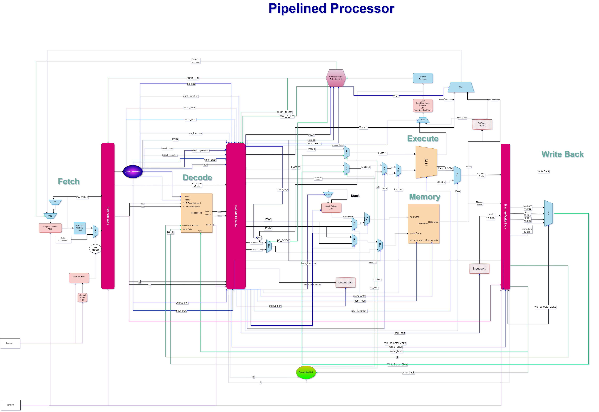

# Pipelined RISC CPU Project

This project aims to create a staged pipeline processor running a RISC ISA. The processor also handles hazards to provide efficient performance.

A harvard architecture (different code and data memories) is assumed for memory.

The processor is specified using verilog behavioral models.

# Instructions' format of the design

#### Memory Instructions

|   Instruction    | Op-Code |    First Operand     |     Second Operand      |
| :--------------: | :-----: | :------------------: | :---------------------: |
|  LDM R_dst, Imm  |  10010  | R_dst2 R_dst1 R_dst0 | I7 I6 I5 I4 I3 I2 I1 I0 |
| LDD R_src, R_dst |  10011  | R_dst2 R_dst1 R_dst0 |  R_src2 R_src1 R_src0   |
| STD R_src, R_dst |  10000  | R_dst2 R_dst1 R_dst0 |  R_src2 R_src1 R_src0   |
|    PUSH R_dst    |  10100  | R_dst2 R_dst1 R_dst0 |        xxxxxxxx         |
|    POP R_dst     |  10111  | R_dst2 R_dst1 R_dst0 |        xxxxxxxx         |

#### Branch Instructions

| Instruction | Op-Code |    First Operand     | Second Operand |
| :---------: | :-----: | :------------------: | :------------: |
|  JZ R_dst   |  11000  | R_dst2 R_dst1 R_dst0 |    xxxxxxxx    |
|  JN R_dst   |  11001  | R_dst2 R_dst1 R_dst0 |    xxxxxxxx    |
|  JC R_dst   |  11010  | R_dst2 R_dst1 R_dst0 |    xxxxxxxx    |
|  JMP R_dst  |  11011  | R_dst2 R_dst1 R_dst0 |    xxxxxxxx    |

<!-- For pdf styling
 
 
  -->

#### ALU With Immediate

| Instruction | Op-Code |    First Operand     |     Second Operand      |
| :---------: | :-----: | :------------------: | :---------------------: |
|  SHL R_dst  |  11110  | R_dst2 R_dst1 R_dst0 | I7 I6 I5 I4 I3 I2 I1 I0 |
|  SHR R_dst  |  11111  | R_dst2 R_dst1 R_dst0 | I7 I6 I5 I4 I3 I2 I1 I0 |

#### Port Instructions

| Instruction | Op-Code |    First Operand     | Second Operand |
| :---------: | :-----: | :------------------: | :------------: |
|  IN R_dst   |  11100  | R_dst2 R_dst1 R_dst0 |    xxxxxxxx    |
|  OUT R_dst  |  11001  | R_dst2 R_dst1 R_dst0 |    xxxxxxxx    |

#### Special Instructions

| Instruction | Op-Code |    First Operand     | Second Operand |
| :---------: | :-----: | :------------------: | :------------: |
|     NOP     |  00000  |       xxxxxxxx       |    xxxxxxxx    |
|    SETC     |  00111  |       xxxxxxxx       |    xxxxxxxx    |
|    CLRC     |  00110  |       xxxxxxxx       |    xxxxxxxx    |
| CALL R_dst  |  00101  | R_dst2 R_dst1 R_dst0 |    xxxxxxxx    |
|     RET     |  00010  |       xxxxxxxx       |    xxxxxxxx    |
|     RTI     |  00011  |       xxxxxxxx       |    xxxxxxxx    |

#### ALU

|   Instruction    | Op-Code |    First Operand     |    Second Operand    |
| :--------------: | :-----: | :------------------: | :------------------: |
|    NOT R_dst     |  01001  | R_dst2 R_dst1 R_dst0 |       xxxxxxxx       |
| ADD R_src, R_dst |  01010  | R_dst2 R_dst1 R_dst0 | R_src2 R_src1 R_src0 |
| SUB R_src, R_dst |  01011  | R_dst2 R_dst1 R_dst0 | R_src2 R_src1 R_src0 |
| AND R_src, R_dst |  01100  | R_dst2 R_dst1 R_dst0 | R_src2 R_src1 R_src0 |
| OR R_src, R_dst  |  01101  | R_dst2 R_dst1 R_dst0 | R_src2 R_src1 R_src0 |
|    INC R_dst     |  01110  | R_dst2 R_dst1 R_dst0 |       xxxxxxxx       |
|    DEC R_dst     |  01111  | R_dst2 R_dst1 R_dst0 |       xxxxxxxx       |
| MOV R_src, R_dst |  01000  | R_dst2 R_dst1 R_dst0 | R_src2 R_src1 R_src0 |

# Schematic diagram of the processor with data flow details

# Types of Hazards

1. Data-Hazards: Eliminated by alu/memory to alu/memory forwarding.
   > We don't have load use case since we are using only 4-stage processor.
2. Control-Hazards: Using static branch prediction to fix this type of hazard

# Contributors

- Karim Mahmoud
- Mohamed Abdulhady
- Mohamed Kotb
- Mohamed Kamal

## Tasks

[Task Sheet](https://docs.google.com/spreadsheets/d/1D9qAlcgd-0N4cCEhQPM2RfYaWhL4Tm8at3xB_1HLQNQ)

## Useful Links

[DrawIO Block Diagrams](https://app.diagrams.net/#G1ecfGp80xOFaQjzcSQgV2PA2ht1y5aC3U)

[Questions for TA](https://docs.google.com/document/d/12UWOSEn1ba6X9kxw1LqsU7Xq4WzuyXeN-4QmTW9iBMs)

[ISA Draft](https://docs.google.com/document/d/1qlOZfoebDzvLBlgFA5baTDMjcGzi_tNnCJMFG9oIPpo)
